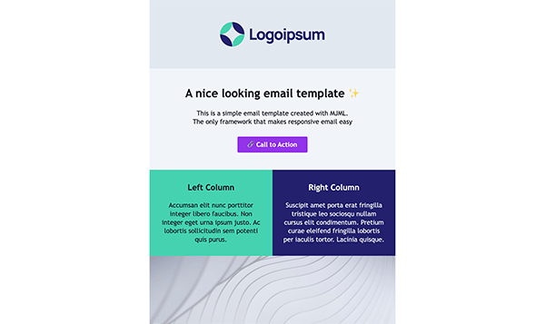

<div align="center">

# mjml. Email Starter Package

[](https://mjml.io/)
[](https://vitejs.dev/)
[](https://www.typescriptlang.org/)
[](https://nodejs.org/)
[](https://www.npmjs.com/)



</div>

## 📖 About

An email templating starter package using [MJML](https://mjml.io/) for templating and [Vite](https://vitejs.dev/) for development.

**Useful resources:**

- [MJML Documentation](https://mjml.io/documentation/)
- [Can I email](https://www.caniemail.com/)
- [Litmus Email Testing (paid)](https://www.litmus.com/email-testing)

### 🔧 Requirements

**Node.js 20 installed on your machine**

See [Node.js](https://nodejs.org/) or preferably use [NVM (Node Version manager)](https://github.com/nvm-sh/nvm)

## 🚀 Quick Start

Install Node.js dependencies

```bash
npm i
```

Start the development server and MJML watcher (typically on [localhost:5173](http://localhost:5173))

```bash
npm run dev
```

Start templating your email in the `src` directory.

## 📦 Build

Build the email template to the `dist` directory

```bash
npm run build
```

Preview the email build in the browser

```bash
npm run preview
```

## 🧰 Tools

Run the TypeScript test

```bash
npm run test
```

Format code with Prettier

```bash
npm run prettier
```

To allow Prettier to format your code on save, configure your editor:<br>
[Prettier Editor Integration](https://prettier.io/docs/en/editors)

ℹ️ **Ensure to include `.mjml` files in your editor's Prettier configuration**

## 📤 Sending Test Emails with SMTP

It is possible to send test emails of a build. It requires to set up a `.env` according to the `.env.example` file.

```bash
cp .env.example .env
```

**Fill in the required SMTP credentials, and email addresses.**

Then run the following command to send a test email:

```bash
npm run send:mail
```
